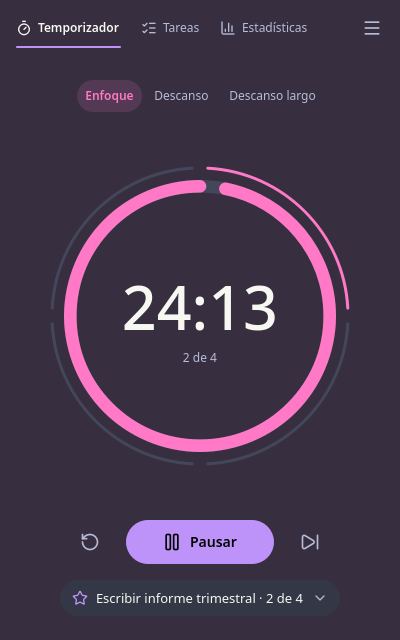

# Foco

Temporizador Pomodoro de escritorio para Kubuntu, Windows 11 y macOS. Núcleo en Rust, interfaz
en Qt 6 con QML (lenguaje declarativo de interfaces de Qt) y la paleta Dracula.



## Control de cambios

| Versión | Fecha | Autor | Descripción del cambio |
| --- | --- | --- | --- |
| 0.1.0 | 2026-10-07 | Andrés García | Primera versión del documento |

## Qué hace

- Ciclo de enfoque, descanso y descanso largo con duraciones configurables.
- Anillo doble: progreso de la fase y ciclo de cuatro enfoques; el fondo cambia de tono por fase.
- Tareas con estimación en pomodoros, tarea activa y deshacer al eliminar.
- Estadísticas de hoy, racha y semana; exportación del historial a CSV (valores separados por
  comas).
- Notificaciones nativas, sonido opcional, bandeja del sistema, modo mini siempre encima.
- Apariencia Drácula (oscura), Alucard (clara) o según el sistema; atajos para todo.
- Sin cuentas ni red: los datos viven en un archivo local.

## Estructura

| Carpeta | Contenido |
| --- | --- |
| `docs/01-analisis` | Requisitos, casos de uso y riesgos |
| `docs/02-diseno` | Arquitectura, máquina de estados, datos y decisiones |
| `docs/03-ui-ux` | Especificación, sistema de diseño, textos, galería y revisión |
| `docs/04-calidad` | Plan de pruebas |
| `docs/05-despliegue` | Compilación y empaquetado por plataforma |
| `crates/foco-core` | Lógica del método en Rust, sin Qt, con pruebas |
| `crates/foco-app` | Puente CXX-Qt y arranque de la aplicación |
| `qml/Foco` | Interfaz completa en QML |
| `tools/prototipo` | Renderizador de la galería con datos simulados |

## Compilar y probar

```bash
cargo test -p foco-core          # núcleo, sin Qt
cargo run -p foco-app --release  # aplicación (requiere Qt 6.10 o superior)
scripts/validar-docs.sh          # documentos
```

Requisitos de cada plataforma en `docs/05-despliegue/compilacion.md`.

## Licencia

GPL 3.0 o posterior. Iconos de Lucide bajo licencia ISC (`qml/Foco/icons/LICENSE-lucide.txt`).
